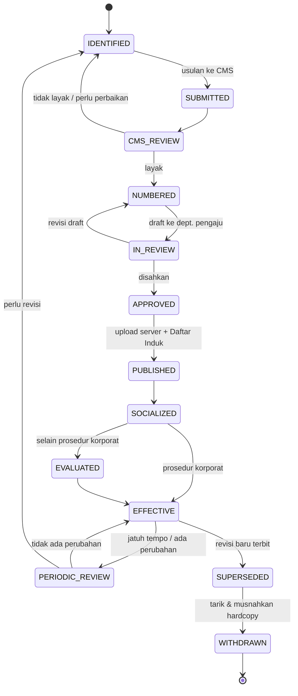
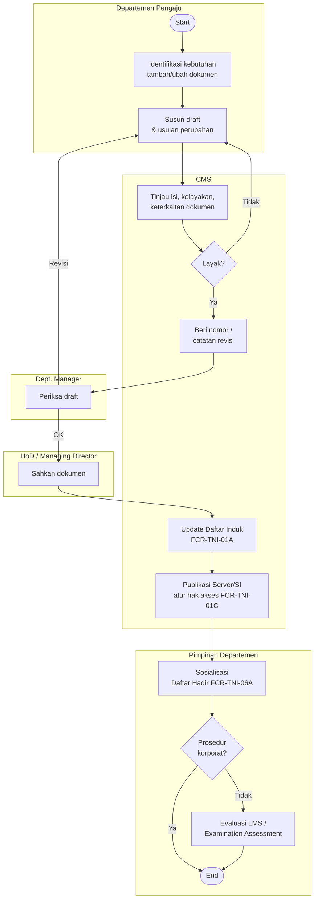

# Spesifikasi Pengendalian Dokumen — Project BPMN

## 0. Cara Membaca Dokumen Ini

Dokumen ini menerjemahkan PCR-TNID-01 Rev.12 menjadi aturan yang bisa langsung dipakai di project BPMN (model proses, penamaan file, metadata, validasi nomor dokumen, dan alur approval). Setiap aturan diberi label sumber:

| Label | Arti |
|---|---|
| `[SOP §x]` | Diambil langsung dari PCR-TNID-01 Rev.12 pasal x |
| `[INTERPRETASI]` | Tafsiran atas SOP karena SOP tidak eksplisit; boleh dipakai sebagai default |
| `[PERLU KONFIRMASI]` | SOP ambigu/inkonsisten; wajib dikonfirmasi ke CMS sebelum di-hardcode |

Prinsip implementasi:

1. **Role-based, bukan name-based.** Lane, approver, dan hak akses mengacu ke jabatan/unit, bukan nama orang. Nama pemegang jabatan hanya lookup yang bisa berubah saat struktur organisasi direvisi.
2. **SOP adalah sumber kebenaran.** Jika spesifikasi ini bertentangan dengan revisi SOP yang lebih baru, SOP yang berlaku.
3. **Model BPMN = bagian dari dokumen terkendali.** Diagram alur di dalam prosedur tunduk pada siklus revisi prosedur induknya (lihat §10.6).

---

## 1. Jenis Dokumen dan Format Nomor `[SOP §6.1]`

| Jenis Dokumen | Document Type | Format Kode | Disiapkan | Diperiksa | Disetujui |
|---|---|---|---|---|---|
| Manual Integrasi | Integration Manual | `MI-TNI-01` | Tim CMS | HoD SID | President Director |
| Kebijakan | Policy | `-` (tanpa kode) | Tim CMS | HoD SID | President Director |
| Kebijakan Manajemen | Management Policy | `KM` | Responsible Manager | Responsible HoD | President Director + Director |
| Prosedur | Procedure | `PX-TNI-YY` | Tim | Dept. Manager | Head of Div. / President Director |
| Prosedur SCS | Procedure (SCS only) | `PX-SCH-TNI-YY` | Tim | Dept. Manager | Head of Division |
| Instruksi Kerja | Working Instruction | `WX-TNI-YYZ` | Tim | Dept. Manager | Head of Div. / Dept. Manager |
| Formulir | Form | `FX-TNI-YYZ` | Tim | Dept. Manager | Dept. Manager |
| Metode (Lab only) | Method | `MA-BB_YY` | Tim | Dept. Manager | Dept. Manager |

Keterangan placeholder:

| Placeholder | Arti | Format |
|---|---|---|
| `X` | Kode departemen / unit bisnis (lihat §2) | huruf, case-sensitive |
| `SCH` | Scheme code (lihat §2.2) | huruf, case-sensitive |
| `TNI` | Kode perusahaan PT TÜV NORD Indonesia | literal |
| `YY` | Nomor urut dokumen | 2 digit angka, `01`–`99` |
| `Z` | Nomor urut turunan | 1 huruf kapital `A`–`Z` |
| `A` | Jenis metode | `U` = Pengujian/Testing, `K` = Kalibrasi/Calibration |
| `BB` | Kode kategori metode (lihat §2.4) | 2 digit angka |

### 1.1 Contoh Nomor

| Nomor | Arti |
|---|---|
| `PCR-TNI-01` | Prosedur Corporate no. 01 (Pengendalian Dokumen) |
| `FCR-TNI-01A` | Formulir A turunan prosedur CR no. 01 (Daftar Induk Dokumen) |
| `FCR-TNI-06A` | Formulir A turunan prosedur CR no. 06 (Daftar Hadir) |
| `PHR-TNI-03` | Prosedur HRD no. 03 `[INTERPRETASI]` |
| `WCAL-TNI-02B` | Instruksi kerja B turunan prosedur Lab Kalibrasi no. 02 `[INTERPRETASI]` |
| `PSC-Q-TNI-01` | Prosedur System Certification skema Quality MS no. 01 `[INTERPRETASI]` |
| `MU-04_02` | Metode Uji Mikrobiologi no. 02 `[INTERPRETASI]` |
| `MK-03_01` | Metode Kalibrasi Suhu no. 01 `[INTERPRETASI]` |

---

## 2. Tabel Kode `[SOP §6.1 Note]`

### 2.1 Kode X — Supporting Department

| Kode | Keterangan | Kandidat unit di org 001/TNI/HRD/IX/2026 `[INTERPRETASI]` |
|---|---|---|
| `CR` | Corporate | Prosedur korporat (Business Partner) |
| `HSE` | CMS | Corporate Management System (Dept. di bawah SID) |
| `HR` | HRD | HR (Human Capital) |
| `GA` | GA | GA (Human Capital) |
| `TFN` | Transformation | Belum ada unit eksplisit `[PERLU KONFIRMASI]` |
| `IM` | Improvement | Corporate Innovation & Sustainability? `[PERLU KONFIRMASI]` |
| `IT` | Information System | IT & Digitalization |
| `PRO` | Procurement | Procurement (General Support) |
| `FN` | Finance | Corporate Finance |
| `ACC` | Accounting | Accounting & Taxation |
| `BD` | Business Development | Business Development (PCT) / Business Dev. & Mktg (Inspection) `[PERLU KONFIRMASI]` |
| `MC` | Marketing Communication | C. Marketing & Communication |
| `SP` | Strategic Partnership | Tidak ada di bagan organisasi |
| `DT` | Digital Transformation | Kemungkinan tergabung di IT & Digitalization `[PERLU KONFIRMASI]` |
| `LG` | Legal | Legal Adm. Support |
| `CO` | Compliance | Tidak ada di bagan organisasi |
| `DI` | Data Insight | Tidak ada di bagan organisasi |

Unit di bagan organisasi yang **belum punya kode** `[PERLU KONFIRMASI]`: Revenue & Invest. Controlling, C. Planner, C. Portfolio & Client Management, MD's Secretary, People & Emp. (New Business Unit Dev.), Corporate Innovation & Sustainability (jika bukan `IM`).

### 2.2 Kode Unit Bisnis dan Scheme Code

**System Certification (Certification Services)**

| Kode | Keterangan |
|---|---|
| `SC` | System Certification (kode X) |

**SCH — Scheme Code untuk SCS**

| Kode | Keterangan | Kode | Keterangan |
|---|---|---|---|
| `INT` | Integrated Management System | `GHG` | Greenhouse Gas (Verification) |
| `Q` | Quality Management System | `ISPO` | Indonesia Sustainable Palm Oil |
| `E` | Environmental Management System | `EO` | Educational Organization MS |
| `F` | Food Safety Management System | `NA` | Non Accredited |
| `T` | Tourism | `C` | Compliance Management System |
| `IS` | Information Security MS | `SE` | Sustainability Event MS |
| `S` | Services Management System | `PIM` | Privacy Information MS |
| `En` | Energy Management System | `ISCO` | ISCC CORSIA |
| `MD` | Medical Devices – QMS | `IATF` | International Automotive Task Force |
| `AB` | Anti-Bribery Management System | `EnA` | Energi Audit |
| `OHS` | Occupational Health & Safety MS | | |

**Lab Service (Laboratory Services)**

| Kode | Keterangan |
|---|---|
| `LAB` | Prosedur berlaku di semua area laboratorium |
| `TEST` | Prosedur berlaku untuk laboratorium pengujian |
| `CAL` | Prosedur berlaku untuk laboratorium kalibrasi |

**Product Certification & Testing (PCT Services)**

| Kode | Keterangan |
|---|---|
| `PC` | Product Certification |
| `PT` | Product Testing |
| `SPC` | Skema Sertifikasi |

**SCH — Scheme Code untuk PCT**

| Kode | Keterangan |
|---|---|
| `VE` | Verifikasi Ekolabel |
| `GB` | Green Building |
| `GTR` | Green Toll Road Indonesia |

**Inspection & Training**

| Kode | Keterangan |
|---|---|
| `IS` | Inspection (kode X — beda konteks dengan scheme `IS` = Information Security) |
| `TR` | Training / TÜV NORD Academy |

### 2.3 Kode A — Jenis Metode

| Kode | Keterangan |
|---|---|
| `U` | Pengujian / Testing |
| `K` | Kalibrasi / Calibration |

### 2.4 Kode BB — Kategori Metode

| BB | Metode Pengujian (`U`) | Metode Kalibrasi (`K`) |
|---|---|---|
| 01 | Metode Uji Proximate | Metode Kalibrasi Volume |
| 02 | Metode Uji Khusus | Metode Kalibrasi Massa |
| 03 | Metode Uji Instrument | Metode Kalibrasi Suhu |
| 04 | Metode Uji Mikrobiologi | Metode Kalibrasi Dimensi |
| 05 | Metode Uji Non Food | Metode Kalibrasi Instrument |
| 06 | Metode Uji Farmasi dan Bahan Kimia Obat | Metode Kalibrasi Tekanan |
| 07 | Metode Sampling Industrial Hygiene | Metode Kalibrasi Waktu dan Putaran |
| 08 | Metode Uji Lube Oil | Metode Kalibrasi Gaya |
| 09 | Metode Uji Produk K3L | Metode Kalibrasi Kelistrikan |
| 10 | Metode Sampling Udara Emisi | Metode Kalibrasi Laju Alir |
| 11 | Metode Sampling Udara Ambien | — |
| 12 | Metode Sampling Water, Soil, Sedimen | — |
| 13 | Metode Uji Laboratorium Testing Product | — |

---

## 3. Aturan Validasi Nomor Dokumen

### 3.1 Regex

Semua kode **case-sensitive** (`En`, `EnA` memakai huruf kecil). Anchor `^...$` wajib dipakai.

```regex
# Kode X gabungan (supporting dept + unit bisnis)
X      = (CR|HSE|HR|GA|TFN|IM|IT|PRO|FN|ACC|BD|MC|SP|DT|LG|CO|DI|SC|LAB|TEST|CAL|PC|PT|SPC|IS|TR)
SCH_SC = (INT|Q|E|F|T|IS|S|En|MD|AB|OHS|GHG|ISPO|EO|NA|C|SE|PIM|ISCO|IATF|EnA)

# Manual Integrasi
^MI-TNI-01$

# Prosedur umum
^P(?<x>X)-TNI-(?<yy>\d{2})$

# Prosedur SCS dengan scheme code
^PSC-(?<sch>SCH_SC)-TNI-(?<yy>\d{2})$

# Instruksi kerja
^W(?<x>X)-TNI-(?<yy>\d{2})(?<z>[A-Z])$

# Formulir
^F(?<x>X)-TNI-(?<yy>\d{2})(?<z>[A-Z])$

# Metode laboratorium
^MU-(?<bb>0[1-9]|1[0-3])_(?<yy>\d{2})$
^MK-(?<bb>0[1-9]|10)_(?<yy>\d{2})$
```

### 3.2 Aturan Turunan (Parent–Child) `[INTERPRETASI]`

1. Formulir dan instruksi kerja adalah turunan dari prosedur dengan `X` dan `YY` yang sama: `FCR-TNI-01A` → induk `PCR-TNI-01`; `FCR-TNI-06A` → induk `PCR-TNI-06`.
2. Sistem wajib menolak pembuatan `FX-TNI-YYZ` / `WX-TNI-YYZ` jika prosedur induk `PX-TNI-YY` tidak ada di Daftar Induk Dokumen.
3. `Z` dialokasikan berurutan per induk (`A`, `B`, `C`, …). Kode yang pernah dipakai tidak boleh dipakai ulang walaupun dokumennya sudah obsolete (contoh: `FCR-TNI-01E` dilebur ke `FCR-TNI-01C` pada Rev.10, huruf `E` tidak dialokasikan lagi).
4. Batas `Z` = 26 turunan per prosedur. Aturan setelah `Z` belum diatur `[PERLU KONFIRMASI]`.
5. Pencabutan prosedur induk memicu review status seluruh turunannya.

### 3.3 Aturan Lain

| Aturan | Sumber |
|---|---|
| Nomor dokumen baru hanya diberikan oleh CMS | `[SOP §4.6, §6.3.3]` |
| Nomor diberikan pada tahap **draft**, sebelum review & approval | `[SOP §6.3.4]` |
| Nomor revisi 2 digit (`01`, `12`) | `[INTERPRETASI]` dari catatan revisi |
| Format tanggal di header `DD.MM.YYYY` (contoh `17.09.2026`) | `[INTERPRETASI]` dari header |
| Kebijakan (Policy) tidak memiliki kode dokumen | `[SOP §6.1]` |
| Format lengkap nomor `KM` belum didefinisikan | `[PERLU KONFIRMASI]` |

---

## 4. Matriks Tanggung Jawab dan Mapping Organisasi

### 4.1 Tanggung Jawab per Peran `[SOP §4]`

| Peran | Tanggung Jawab |
|---|---|
| President Director / Managing Director | Menyetujui Manual Integrasi, Kebijakan Perusahaan, Peraturan Perusahaan, dokumen kebijakan strategis lain |
| Management (President Director + Director) | Menyetujui Kebijakan Manajemen |
| Head of Division | Menyetujui prosedur operasional divisinya |
| Manager (Head of Department) | Mereview prosedur operasional dan instruksi kerja departemennya |
| Tim Departemen | Membuat dan mengusulkan perubahan dokumen |
| CMS | Penomoran, distribusi, review Manual Integrasi, prosedur corporate dan HSE; memelihara Daftar Induk Dokumen; menyimpan dokumen asli |

### 4.2 Mapping Peran SOP ke Struktur Organisasi 001/TNI/HRD/IX/2026

Kolom "Pemegang" hanya untuk lookup; jangan di-hardcode di model BPMN.

| Peran di SOP | Unit di Bagan Organisasi | Pemegang (per 09.09.2026) |
|---|---|---|
| President Director / Managing Director | Managing Directors | Herdiansyah; Bayu Wicaksana Jr. |
| Director | Tidak ada jabatan "Director" terpisah di bagan `[PERLU KONFIRMASI]` | — |
| HoD SID | Systems, Innovation & Digitalization | Diana Novianty |
| CMS Manager / Dept. CMS | Corporate Management System | Ni'matulloh |
| HoD Finance & Accounting | Finance & Accounting | Mayerina H. |
| HoD Human Capital | Human Capital | VACANT |
| HoD Certification Services | Certification Services | Karlina Bone |
| HoD Laboratory Services | Laboratory Services | Diky Y. Rahman |
| HoD Inspection Services | Inspection Services | Saefulah Ahmad |
| HoD PCT Services | PCT Services | Rista A. Dianameci |
| Dept. Manager | Head of Department / Coordinator masing-masing | sesuai bagan |

### 4.3 Aturan Resolusi Approver

| Kasus | Aturan | Status |
|---|---|---|
| Prosedur/IK dengan approver "Head of Div. / President Director" atau "Head of Div. / Dept. Manager" | Default: HoD divisi pemilik dokumen. President Director untuk prosedur lintas divisi atau milik Non Division Group | `[PERLU KONFIRMASI]` — SOP tidak mendefinisikan kriteria pemilihan |
| Dokumen milik Non Division Group (General Support, Corporate Strategic Support, New Business Unit Dev.) | Tidak ada HoD; eskalasi ke Managing Director | `[INTERPRETASI]` |
| Posisi HoD VACANT (contoh Human Capital) | Butuh aturan delegasi/pengganti (Plt.) | `[PERLU KONFIRMASI]` |
| Deputy HoD (CS, Lab) sebagai approver | SOP tidak menyebut Deputy HoD | `[PERLU KONFIRMASI]` |
| Satu orang mengisi lebih dari satu peran (prepare/review/approve) | Diperbolehkan selama tanggung jawab terpenuhi → sistem memberi **warning**, bukan blokir | `[SOP §6.2.4]` |

---

## 5. Siklus Hidup Dokumen

### 5.1 Status

| Status | Deskripsi | Aktor | Sumber |
|---|---|---|---|
| `IDENTIFIED` | Kebutuhan tambah/ubah dokumen teridentifikasi | Departemen terkait | §6.3.1 |
| `SUBMITTED` | Usulan dikirim ke CMS | Departemen terkait | §6.3.2 |
| `CMS_REVIEW` | CMS meninjau isi, kelayakan, keterkaitan dengan dokumen lain | CMS | §6.3.2 |
| `NUMBERED` | CMS memberi nomor (dokumen baru) dan/atau membuat catatan revisi | CMS | §6.3.3 |
| `IN_REVIEW` | Draft diperiksa pemeriksa sesuai §6.1 | Dept. Manager / HoD | §6.3.4 |
| `APPROVED` | Disahkan (tanda tangan basah / elektronik) | Approver sesuai §6.1 | §6.2.5, §6.3.4 |
| `PUBLISHED` | Dipublikasi di Server/Sistem Informasi, masuk Daftar Induk | CMS | §6.2.6, §6.3.5 |
| `SOCIALIZED` | Disosialisasikan ke personel terkait | Pimpinan Departemen | §6.3.6 |
| `EVALUATED` | Evaluasi pemahaman (wajib untuk selain prosedur korporat) | Pimpinan Departemen | §6.3.7 |
| `EFFECTIVE` | Dokumen berlaku | — | — |
| `PERIODIC_REVIEW` | Kaji ulang berkala/insidental | Personel berwenang + CMS | §6.5 |
| `SUPERSEDED` | Digantikan revisi baru | CMS | §6.7 `[INTERPRETASI]` |
| `WITHDRAWN` | Hardcopy kedaluwarsa ditarik dan dimusnahkan | CMS | §6.7 |

### 5.2 Diagram Status



---

## 6. Proses Penambahan / Perubahan Dokumen (Referensi Model BPMN) `[SOP §6.3]`

### 6.1 Lane

| Lane | Peran |
|---|---|
| Departemen Pengaju (Tim) | Pembuat dokumen |
| Dept. Manager | Pemeriksa |
| CMS | Penomoran, review kelayakan, publikasi, Daftar Induk |
| Head of Division / Managing Director | Approver sesuai §6.1 |
| Pimpinan Departemen | Sosialisasi & evaluasi |

### 6.2 Langkah Proses

| No | Task (ID) | Lane | Input / Output | Pasal |
|---|---|---|---|---|
| 1 | Identifikasi kebutuhan tambah/ubah dokumen | Departemen Pengaju | — | 6.3.1 |
| 2 | Susun draft & usulan perubahan | Departemen Pengaju | Draft dokumen | 6.2.2, 6.3.2 |
| 3 | Tinjau isi, kelayakan, keterkaitan | CMS | Draft | 6.3.2 |
| 4 | Gateway: layak? | CMS | — | 6.3.2 |
| 5 | Beri nomor / buat catatan revisi | CMS | `[FCR-TNI-01H]` untuk formulir | 6.3.3 |
| 6 | Periksa draft | Dept. Manager | Draft bernomor | 6.3.4 |
| 7 | Sahkan dokumen | HoD / MD | Dokumen ditandatangani | 6.2.5, 6.3.4 |
| 8 | Update Daftar Induk Dokumen | CMS | `[FCR-TNI-01A]` | 6.2.6 |
| 9 | Publikasi di Server/Sistem Informasi, atur hak akses | CMS | `[FCR-TNI-01C]`, `[FCR-TNI-01L]` | 6.3.5 |
| 10 | Kirim sosialisasi via email ke karyawan eksternal | CMS | Email | 6.3.5 |
| 11 | Sosialisasi ke personel terkait | Pimpinan Departemen | `[FCR-TNI-06A]` Daftar Hadir | 6.3.6 |
| 12 | Gateway: prosedur korporat? | Pimpinan Departemen | — | 6.3.7 |
| 13 | Evaluasi via LMS / Examination Assessment | Pimpinan Departemen | Hasil evaluasi | 6.3.7 |
| 14 | Update dokumen di SIM berbasis web masing-masing | Departemen pengguna SIM | — | 6.6.2 |

### 6.3 Diagram Alur



---

## 7. Proses Pendukung

### 7.1 Penggandaan Dokumen (Hardcopy) `[SOP §6.4]`

| Aturan | Detail |
|---|---|
| Permintaan | Via `[FCR-TNI-01D]` Permintaan Penggandaan Dokumen, dibedakan internal vs eksternal |
| Pelaksana | CMS menggandakan sesuai jumlah dan menyerahkan ke peminta |
| Kontrol internal | Salinan internal dicatat di `[FCR-TNI-01C]` Daftar Hak Akses dan Distribusi Dokumen |
| Tidak terkendali | Salinan eksternal dan hasil print langsung dari server/SI berstatus *uncontrolled* |

### 7.2 Kaji Ulang Dokumen `[SOP §6.5]`

| Aturan | Detail |
|---|---|
| Sebelum pengesahan | Semua dokumen dikaji personel berwenang, dibantu CMS |
| Insidental | Kapan saja jika dibutuhkan/ada perubahan |
| Berkala (Laboratorium) | Setiap 3 tahun sesuai `[FCR-TNI-01J]` Program Kaji Ulang Dokumen `[PERLU KONFIRMASI]` — catatan revisi 05 menyebut 2 tahun |
| Pemicu insidental (Lab) | Perubahan metode, peralatan, acuan, dll |
| Rekaman | `[FCR-TNI-01F]` Kaji Ulang Dokumen |
| Implementasi sistem | Timer event berbasis `published_date + review_interval`, konfigurasi interval per unit (bukan hardcode) |

### 7.3 Penyimpanan `[SOP §6.2.7, §6.6]`

| Aturan | Detail |
|---|---|
| Dokumen asli | Hanya disimpan CMS (hardcopy dan/atau softcopy) |
| Softcopy | Disimpan di server, backup berkala, akses terbatas |
| SIM berbasis web | Departemen yang memakai SIM berbasis website/elektronik (mis. SIMCert, SIMLab, SIMCal) wajib memperbarui dokumen di sistemnya setiap ada perubahan → butuh sinkronisasi ke Daftar Induk Dokumen |

### 7.4 Penarikan dan Pemusnahan `[SOP §6.7]`

| Aturan | Detail |
|---|---|
| Identifikasi | CMS mengidentifikasi dokumen kedaluwarsa yang beredar |
| Tindakan | Hardcopy kedaluwarsa ditarik, dimusnahkan, dicatat di `[FCR-TNI-01G]` |
| Softcopy | Tidak diatur eksplisit; rekomendasi: arsip read-only dengan watermark *OBSOLETE* `[INTERPRETASI]` |

### 7.5 Pengendalian Data dan Validasi Data Elektronik `[SOP §6.8, §6.9]`

| Aturan | Detail |
|---|---|
| Data customer | Disimpan di server (IT system) dengan backup berkala |
| Validasi sistem | Setiap sistem komputerisasi/aplikasi wajib divalidasi **sebelum digunakan** |
| Cakupan validasi | Input, fungsi logika, link data, pembulatan, fungsi lain |
| Metode | Bandingkan input vs output, atau hitung manual vs hitung elektronik, atau metode relevan lain |
| Dampak ke project | Otomasi proses dari model BPMN (form, kalkulasi, workflow engine) butuh rekaman validasi sebelum go-live |

### 7.6 Dokumen Eksternal `[SOP §6.10]`

| Aturan | Detail |
|---|---|
| Jenis | Standar, regulasi, perundang-undangan, dll |
| Register | `[FCR-TNI-01B]` Daftar Induk Dokumen Eksternal |
| Pemeriksaan | Tahunan terhadap versi termutakhir |
| Referensi TÜV NORD Group | K-RL (Konzern-Richtlinien), Organigramm, TNCert QMH, Freigegebene Dokumente, IATF 16949 di extranet TÜV NORD |

### 7.7 Kerahasiaan `[SOP §6.11]`

| Aturan | Detail |
|---|---|
| Akses internal | Sesuai fungsi pekerjaan dan hak akses (`[FCR-TNI-01C]`) |
| Akses eksternal | Dengan persetujuan pemilik dokumen, dibatasi, dan pihak eksternal menandatangani `[FCR-TNI-01I]` Pernyataan Kerahasiaan |
| Implementasi | Field `confidentiality` pada metadata dokumen dan model BPMN (lihat §10.3) |

---

## 8. Format Standar Prosedur

### 8.1 Cover

| Elemen | Isi |
|---|---|
| Logo | TÜV NORD (kiri atas), TÜV NORD GROUP (kanan bawah) |
| Judul | `<Judul ID> \| <Judul EN>` huruf kapital |
| Blok identitas | Nama perusahaan, judul, Verified by (mis. CMS Manager), Approved by (mis. Head of SID Division), Nomor Dokumen, Nomor Revisi, Tanggal Penerbitan, Disiapkan Oleh |

### 8.2 Header Setiap Halaman

| Kolom kiri | Kolom tengah | Kolom kanan |
|---|---|---|
| Logo TÜV NORD | `<Judul ID> \| <Judul EN>` | Document No. / Revision No. / Published Date (`DD.MM.YYYY`) / Page `x of y` |

### 8.3 Footer Setiap Halaman

```
This document is for internal use of PT. TÜV NORD Indonesia. Uncontrolled when printed.
```

### 8.4 Struktur Isi (Bilingual, 2 Kolom: kiri ID, kanan EN)

| Bab | ID | EN |
|---|---|---|
| — | Daftar Isi | List of Content |
| — | Catatan Revisi | Revision Note(s) |
| 1 | Tujuan | Objective |
| 2 | Ruang Lingkup | Scope |
| 3 | Definisi | Definition |
| 4 | Tanggung Jawab | Responsibility |
| 5 | Referensi | Reference |
| 6 | Tahapan Prosedur | Stages of Procedure |
| 7 | Dokumen Terkait | Related Document |

### 8.5 Tabel Catatan Revisi

| No. | Revision No | Revision Date | Part No | Revision Note(s) |
|---|---|---|---|---|

Aturan:

1. Semua revisi dicatat kumulatif sejak revisi 01.
2. Perubahan pada revisi yang berlaku ditandai **teks merah**, baik di tabel catatan revisi maupun di badan dokumen `[INTERPRETASI]` dari Rev.12.
3. `Part No` merujuk nomor pasal yang berubah, atau `All` untuk perubahan menyeluruh.

### 8.6 Bab 7 Dokumen Terkait

Daftar formulir/dokumen turunan dengan format `<nomor urut>  <nama dokumen> ........ <kode dokumen>`.

### 8.7 Diagram Alur di Dalam Prosedur

Dokumen yang membutuhkan diagram alur mengikuti `[FCR-TNI-01K]` Referensi Simbol Standar Diagram Alur `[SOP §6.2.3]`. Isi FCR-TNI-01K belum tersedia di project ini; pemetaan simbol di §10.4 wajib diselaraskan dengan FCR-TNI-01K `[PERLU KONFIRMASI]`.

### 8.8 Template Markdown Prosedur

```markdown
---
doc_no: PXX-TNI-YY
title_id: <Judul Indonesia>
title_en: <English Title>
revision: "00"
published_date: DD.MM.YYYY
prepared_by: <Tim / Departemen>
reviewed_by: <Dept. Manager>
approved_by: <HoD / President Director>
owner_unit: <Unit pemilik>
confidentiality: internal   # public | internal | confidential
review_interval_months: 36  # jika berlaku
bpmn_files: [PXX-TNI-YY_R00_<slug>.bpmn]
---

# <JUDUL ID> | <ENGLISH TITLE>

## Catatan Revisi | Revision Note(s)
| No. | Revision No | Revision Date | Part No | Revision Note(s) |
|---|---|---|---|---|
| 1 | 00 | DD Month YYYY | All | Penerbitan awal |

## 1. Tujuan | Objective
## 2. Ruang Lingkup | Scope
## 3. Definisi | Definition
## 4. Tanggung Jawab | Responsibility
## 5. Referensi | Reference
## 6. Tahapan Prosedur | Stages of Procedure
### 6.1 ...
> Diagram alur: lihat `PXX-TNI-YY_R00_<slug>.bpmn`
## 7. Dokumen Terkait | Related Document
| No | Nama Dokumen | Kode |
|---|---|---|
| 7.1 | ... | FXX-TNI-YYA |

---
This document is for internal use of PT. TÜV NORD Indonesia. Uncontrolled when printed.
```

---

## 9. Daftar Formulir Terkait PCR-TNID-01 `[SOP §7]`

| Kode | Nama | Dipakai di |
|---|---|---|
| FCR-TNI-01A | Daftar Induk Dokumen | §6.2.6 |
| FCR-TNI-01B | Daftar Induk Dokumen Eksternal | §6.10 |
| FCR-TNI-01C | Daftar Hak Akses dan Distribusi Dokumen | §6.3.5, §6.4.3, §6.11 |
| FCR-TNI-01D | Permintaan Penggandaan Dokumen | §6.4.1 |
| FCR-TNI-01E | *(dilebur ke 01C pada Rev.10 — jangan dipakai)* | — |
| FCR-TNI-01F | Kaji Ulang Dokumen | §6.5 |
| FCR-TNI-01G | Laporan Pemusnahan Dokumen dan Rekaman | §6.7.2 |
| FCR-TNI-01H | Catatan Revisi Formulir | §6.3.3 |
| FCR-TNI-01I | Pernyataan Kerahasiaan | §6.11 |
| FCR-TNI-01J | Program Kaji Ulang Dokumen | §6.5 |
| FCR-TNI-01K | Referensi Simbol Standar Diagram Alur | §6.2.3 |
| FCR-TNI-01L | Pengajuan Akses Server | §6.3.5 |
| FCR-TNI-06A | Daftar Hadir | §6.3.6 |

---

## 10. Konvensi Project BPMN

### 10.1 Penamaan File

```
<DocNo>_R<RevNo>_<slug>.bpmn
```

| Contoh | Keterangan |
|---|---|
| `PCR-TNI-01_R12_pengendalian-dokumen.bpmn` | Model alur prosedur pengendalian dokumen rev.12 |
| `L0_TNI_business-process_R02.bpmn` | Model Level 0 (value chain) — tidak punya nomor dokumen sendiri kecuali diterbitkan sebagai lampiran MI-TNI-01 `[PERLU KONFIRMASI]` |

Aturan: `slug` huruf kecil, kata dipisah `-`, tanpa spasi. Nomor revisi file BPMN **sama** dengan nomor revisi prosedur induk.

### 10.2 Hierarki Level dan Keterlacakan ke Dokumen

| Level BPMN | Isi | Tautan dokumen |
|---|---|---|
| Level 0 | Value chain: core process (Certification, Laboratory, Inspection, PCT) dan supporting process | MI-TNI-01 / Kebijakan |
| Level 1 | Swimlane per proses, lane per unit/peran | 1 proses ↔ 1 prosedur `PX-TNI-YY` |
| Level 2 | Detail aktivitas | Instruksi kerja `WX-TNI-YYZ` / Metode `MA-BB_YY` |
| Data object | Rekaman/formulir | `FX-TNI-YYZ` |

Setiap call activity di Level 0 yang turun ke Level 1 wajib membawa properti `docNo` prosedur induk.

### 10.3 Metadata Wajib per Model

Disimpan sebagai extension properties di elemen `<bpmn:process>` (format mengikuti tool, contoh Camunda `camunda:properties`):

| Properti | Contoh | Wajib |
|---|---|---|
| `docNo` | `PCR-TNI-01` | Ya |
| `revision` | `12` | Ya |
| `publishedDate` | `17.09.2026` | Ya |
| `titleId` / `titleEn` | `Prosedur Pengendalian Dokumen` / `Document Control Procedure` | Ya |
| `ownerUnit` | `SID - Corporate Management System` | Ya |
| `preparedBy` / `reviewedBy` / `approvedBy` | peran, bukan nama | Ya |
| `status` | status sesuai §5.1 | Ya |
| `confidentiality` | `internal` | Ya |
| `orgReference` | `001/TNI/HRD/IX/2026` | Ya |
| `bpmLevel` | `0` / `1` / `2` | Ya |
| `parentProcess` | ID proses Level di atasnya | Jika level > 0 |

### 10.4 Pemetaan Elemen BPMN `[INTERPRETASI — selaraskan dengan FCR-TNI-01K]`

| Konsep prosedur | Elemen BPMN | Konvensi label |
|---|---|---|
| Perusahaan | Pool | `PT TÜV NORD Indonesia` |
| Unit/peran pelaksana | Lane | Nama peran dari §4.2 (bukan nama orang) |
| Pihak eksternal (pelanggan, KAN, badan akreditasi) | Pool terpisah (collapsed) | Nama pihak |
| Langkah prosedur | Task | Kata kerja + objek, Bahasa Indonesia (EN di documentation) |
| Persetujuan / tanda tangan | User Task | Diawali "Sahkan" / "Setujui" |
| Keputusan | Exclusive Gateway | Pertanyaan diakhiri `?`, jalur diberi label `Ya` / `Tidak` |
| Formulir/rekaman | Data Object | `[FCR-TNI-01A] Daftar Induk Dokumen` |
| Server / Sistem Informasi / SIM | Data Store | Nama sistem |
| Kaji ulang berkala | Timer Start Event | Interval dari metadata |
| Email sosialisasi | Send Task / Message Flow | — |
| Prosedur lain yang dirujuk | Call Activity | Nama + `docNo` prosedur rujukan |

### 10.5 ID Elemen

Format ID (valid XML NCName, pakai underscore):

```
<Type>_<DocNoTanpaStrip>_<PasalSOP>_<Urut>
```

| Contoh | Arti |
|---|---|
| `Process_PCRTNI01` | Proses PCR-TNI-01 |
| `Lane_PCRTNI01_CMS` | Lane CMS |
| `Task_PCRTNI01_6_3_2_01` | Task untuk pasal 6.3.2 |
| `Gateway_PCRTNI01_6_3_7_01` | Gateway pasal 6.3.7 |
| `Data_PCRTNI01_FCRTNI01A` | Data object FCR-TNI-01A |

Setiap task mengisi `documentation` dengan rujukan pasal (contoh `Ref: PCR-TNID-01 §6.3.2`) agar ada keterlacakan dua arah model ↔ teks prosedur.

### 10.6 Pengendalian Perubahan Model

1. Perubahan pada file BPMN yang menjadi bagian dari prosedur = perubahan prosedur → wajib melalui alur §6 (usulan ke CMS, penomoran revisi, review, approval).
2. Versi kerja (draft) boleh disimpan di repository/branch terpisah; hanya versi `APPROVED` yang dipublikasi.
3. Setelah revisi terbit, file revisi lama dipindah ke arsip dengan status `SUPERSEDED`.
4. Jika model dieksekusi di workflow engine/aplikasi, lakukan validasi sesuai §7.5 sebelum dipakai.

---

## 11. Temuan Inkonsistensi di PCR-TNID-01 Rev.12 `[PERLU KONFIRMASI ke CMS]`

| # | Temuan | Lokasi | Dampak ke Implementasi |
|---|---|---|---|
| 1 | Nomor dokumen prosedur ini `PCR-TNID-01`, sedangkan skema penomoran memakai `TNI` (`PX-TNI-YY`) dan semua formulirnya `FCR-TNI-…` | Cover, header vs §6.1 | Regex harus menerima `TNID`? Tentukan apakah `TNID` format baru atau salah ketik |
| 2 | Periode kaji ulang dokumen Lab: catatan revisi 05 = 2 tahun, badan §6.5 = 3 tahun | Catatan Revisi 05 vs §6.5 | Interval timer kaji ulang |
| 3 | Referensi simbol diagram alur: catatan revisi 07 menyebut `FCR-TNI-01J`, badan §6.2.3 dan §7 menyebut `FCR-TNI-01K` (01J = Program Kaji Ulang) | Catatan Revisi 07 vs §6.2.3 | Rujukan standar simbol BPMN |
| 4 | Kontrol salinan internal: versi ID menulis `FCR-TNI-10C` (typo), versi EN masih `FCR-TNI-01E` yang sudah dilebur ke `01C` pada Rev.10 | §6.4.3 | Data object yang dipakai = `FCR-TNI-01C` |
| 5 | Kode `HSE` dipetakan ke "CMS"; belum jelas dokumen baru CMS memakai kode `HSE` atau kode baru | §6.1 Note | Daftar kode X yang valid |
| 6 | Kriteria "Head of Div. / President Director" dan "Head of Div. / Dept. Manager" tidak didefinisikan | §6.1 | Routing approval otomatis |
| 7 | Jabatan "Director" (§4.2, §6.1 KM) tidak ada di struktur organisasi; yang ada "Managing Directors" | §4.2 vs org 001/TNI/HRD/IX/2026 | Approver Kebijakan Manajemen |
| 8 | Scheme code PCT (`VE`, `GB`, `GTR`) tercantum, tetapi format `PX-SCH-TNI-YY` dinyatakan khusus SCS | §6.1 | Apakah PCT juga memakai format dengan scheme code |
| 9 | Kode `IS` dipakai untuk dua arti: Inspection (kode X) dan Information Security (scheme) | §6.1 Note | Aman selama posisi dalam nomor berbeda; tetap dokumentasikan |
| 10 | Beberapa unit di struktur organisasi terbaru belum punya kode dokumen (lihat §2.1) | §6.1 vs org chart | Penomoran dokumen unit baru |
| 11 | Format lengkap nomor Kebijakan Manajemen (`KM`) tidak dijelaskan | §6.1 | Regex KM |
| 12 | Penomoran poin evaluasi versi ID `c./d.`, versi EN `a./b.`; typo "Dept. Managerx`", "Udata Emisi" | §6.3.7, §6.1, tabel BB | Kosmetik, perbaiki di revisi berikutnya |
| 13 | Catatan Rev.11 menghapus kode Digital Transformation Business, tetapi `DT = Digital Transformation` masih ada di tabel kode | Catatan Revisi 11 vs §6.1 | Pastikan `DT` masih aktif |

---

## 12. Riwayat Spesifikasi

| Versi | Tanggal | Perubahan |
|---|---|---|
| 0.1 | 29.09.2026 | Draft awal dari PCR-TNID-01 Rev.12 dan org 001/TNI/HRD/IX/2026 |
